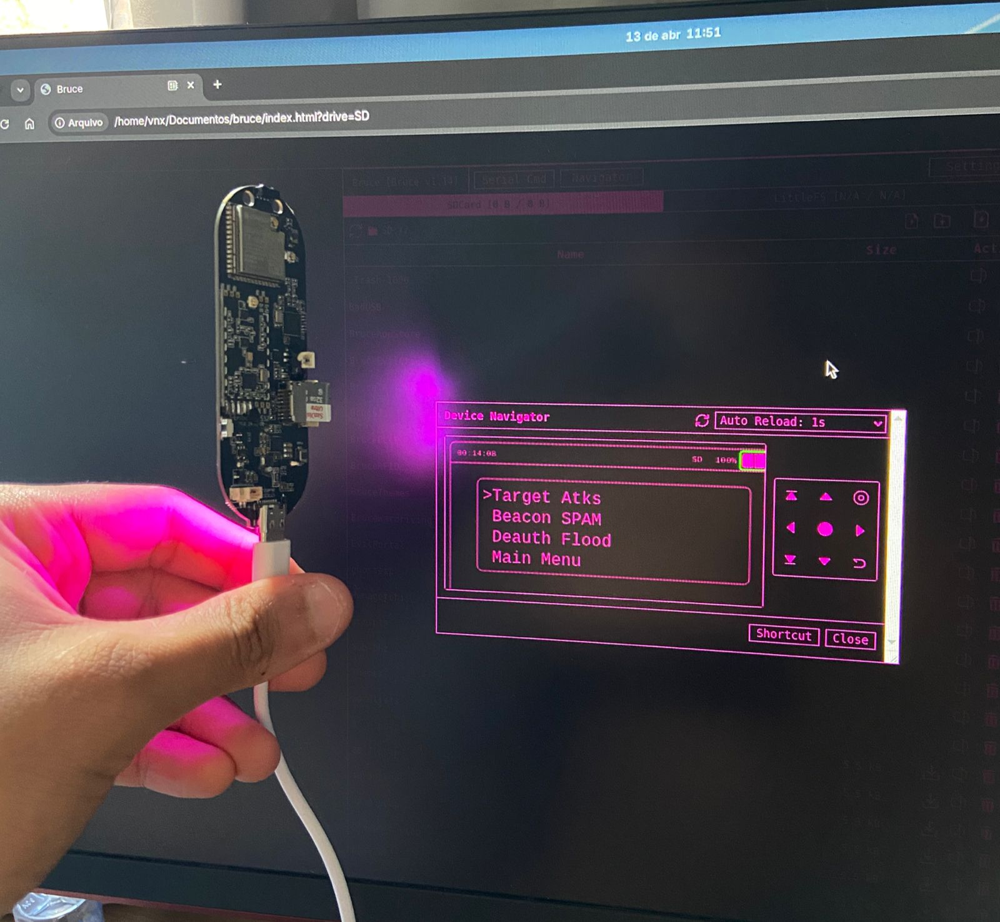
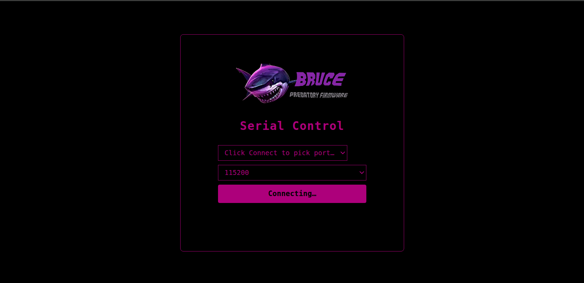
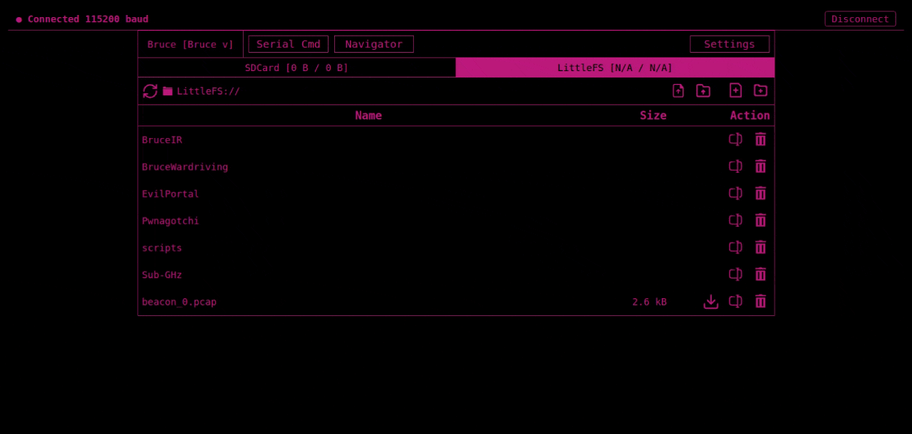

# Bruce Serial WebUI

A standalone web interface for controlling [Bruce firmware](https://github.com/pr3y/Bruce) devices over USB serial. Open `index.html` directly in a Chromium-based browser, click Connect, and the full Bruce interface is available without installing anything.

## Background

My T-Embed's screen broke. The hardware still works perfectly, but without a display there is no way to navigate menus or trigger actions — including the Wi-Fi attack and monitoring features that require interaction from the device side. Bruce's built-in WebUI runs over Wi-Fi, but to start most Wi-Fi functions you first need to navigate into them on the device itself, which is impossible without a screen.

This project solves that: the entire Bruce interface runs in the browser and communicates with the device over USB serial using the Web Serial API. No screen needed on the device.



## How it works

The browser connects directly to the device's USB serial port using the [Web Serial API](https://developer.mozilla.org/en-US/docs/Web/API/Web_Serial_API). A state-machine parser separates two streams arriving on the same wire:

- **Text stream** — command responses ending with the `# ` prompt. Used for file listing, file read/write, storage info, navigation commands, and the serial terminal.
- **Binary TFT stream** — `0xAA`-prefixed draw packets emitted by Bruce's display logger. Used to render a live mirror of the device screen on a canvas element.

## Usage

1. Open `index.html` in Chrome, Edge, or Opera.
2. Select the baud rate (default 115200).
3. Click **Connect** and choose the device from the browser's port picker.
4. The interface loads automatically: storage info, file browser, and screen mirror become available.



## Wi-Fi functions

Once connected via serial you can navigate the device menus from the browser and start any Wi-Fi function. The device executes the attack or scan and the WebUI remains the control surface throughout the session.



## Browser support

The Web Serial API is available in Chromium-based browsers only: Chrome 89+, Edge 89+, and Opera 75+. The page will display a warning and disable the connect button on unsupported browsers.

## File structure

```
bruce/
├── index.html        main interface
├── index.css         styles
├── theme.css         color theme
├── index.js          original Bruce WebUI logic (unmodified)
└── serial-bridge.js  Web Serial API layer
```

## Device compatibility

Tested with Bruce firmware on the Lilygo T-Embed. Any Bruce-compatible device with a USB serial port should work, as the protocol is defined by the firmware, not the hardware.
